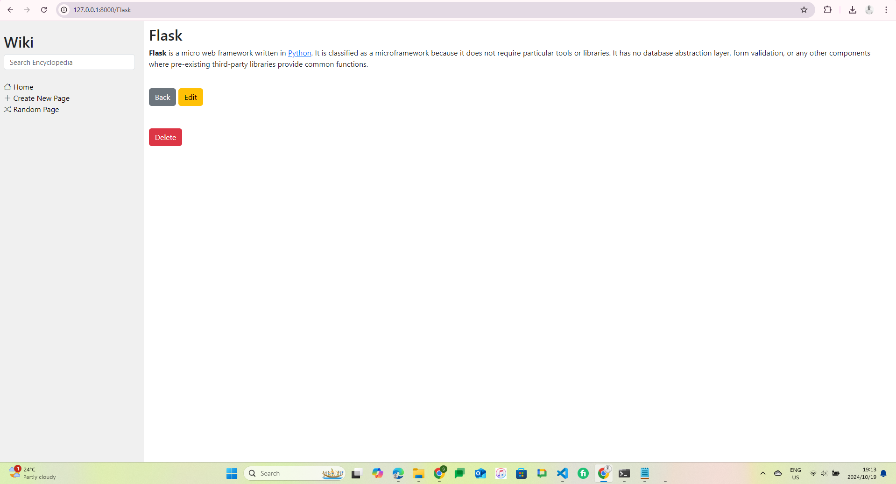
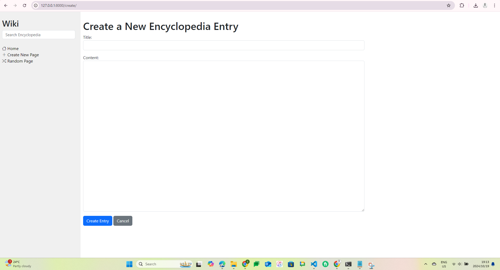
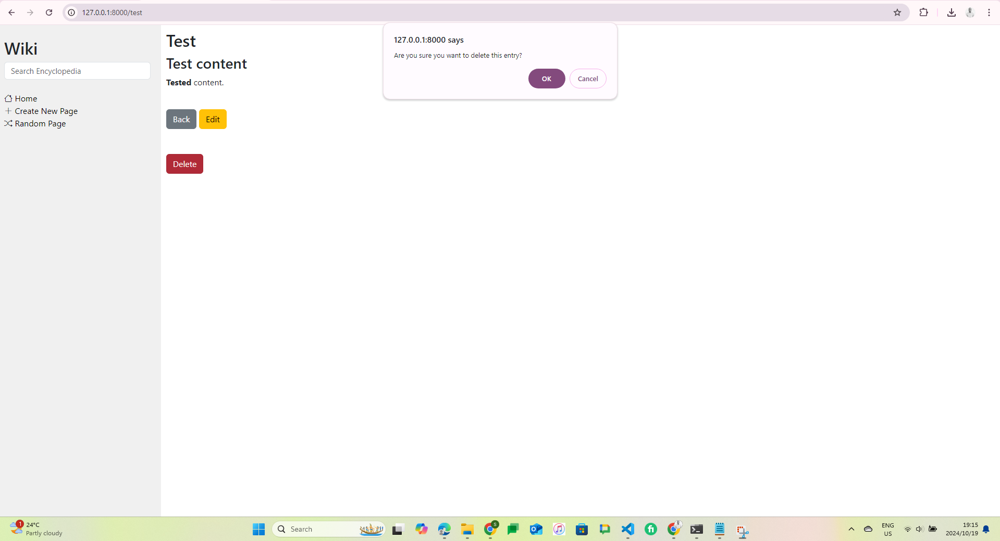
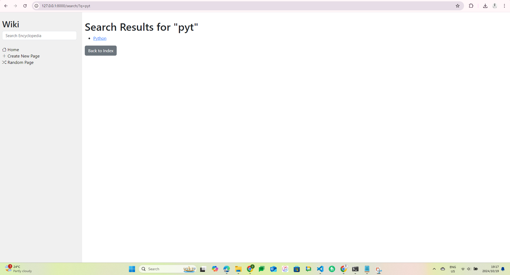

# 'Wiki' Encyclopedia

Wike is a Django-based web application designed to manage 'encyclopedia' style entries. This project includes features for entry management, search functionality, and front-end entry editing.

## Table of Contents

- [Features](#features)
- [Installation](#installation)
- [Usage](#usage)
- [Contributing](#contributing)
- [License](#license)

## Features

- **encyclopedia entry Management**: View and manage entries.
- **Search Functionality**: Search entries by full/(partial) names.
- **Front-End Editing**: Add/Modify/Delete entry details.

## Installation

To get started with this project, follow these steps:

### Clone the Repository

```sh
git clone https://github.com/simminda/wiki.git
cd wiki
```

## Set Up a Virtual Environment

`python -m venv env`

### Activate the Virtual Environment

- **Windows**

```
.\env\Scripts\activate
```

- **MacOS/Linux**

```
source env/bin/activate
```

### Install Dependencies

`pip install -r requirements.txt`

### Apply Migrations

`python manage.py migrate`

### Create a Superuser (Optional)

Create a superuser to access the Django admin interface:

```
python manage.py createsuperuser
```

### Run the Development Server

Start the Django development server:

```
python manage.py runserver
```

You can now access the application at http://127.0.0.1:8000/

### Usage

- **Search for Entries**: Use the search bar in the side bar to find entries using their names or part of their names.
- **Edit Entries**: Edit entry details as needed.
- **Delete Entries**: Delete entry details as needed.

### Contributing

Contributions are welcome! Please open an issue or submit a pull request with your changes.

### License

This project is licensed under the MIT License. See the [LICENSE](LICENSE) file for details.

## Screenshots:


### Landing Page


### View Entries


### Create Entry


### Delete Entry


### Search Entries

